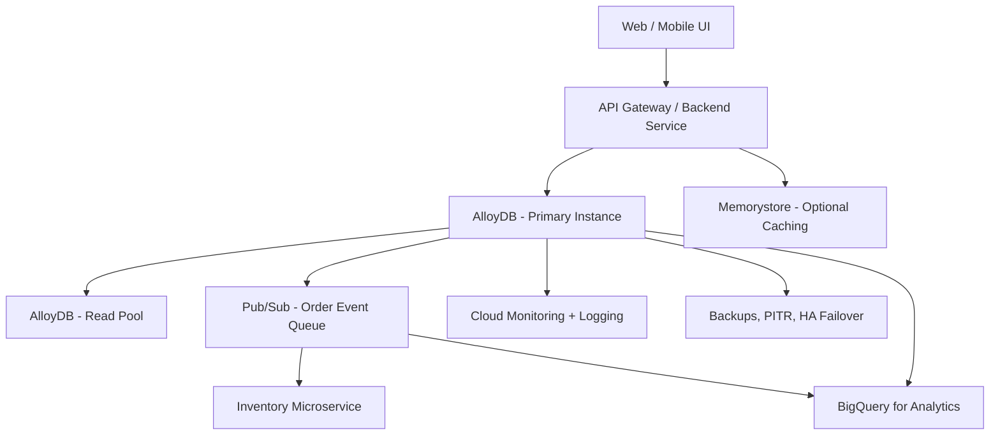

Here’s a **real-time use case with High-Level Design (HLD)** for **AlloyDB** in **Google Cloud**, showcasing its strengths in **transactional performance, analytics, and scalability**:

---

## ✅ **AlloyDB Use Case: Real-Time Order Management System (OMS)**

### 🎯 **Objective:**

Design a scalable, highly available, and analytics-ready **Order Management System** for a retail or e-commerce company, using **AlloyDB** as the primary database engine.

---

## 🔧 **Business Requirements**

* Handle high-volume order transactions (OLTP)
* Support real-time reporting for inventory and sales
* Ensure minimal downtime with automatic failover
* Secure customer and order data with encryption & access control
* Integrate with analytics and AI for recommendations

---

## 📌 **Why AlloyDB?**

| Feature                  | Benefit                                          |
| ------------------------ | ------------------------------------------------ |
| PostgreSQL Compatibility | Ease of migration from existing systems          |
| Columnar Cache           | Built-in vectorized analytics for reporting      |
| High Throughput          | Faster commits, lower read/write latency         |
| HA & Backups             | Automatic failover, PITR, backups                |
| AI-ready                 | ML model serving and analytics extension support |

---

## 🧩 **Solution Components**

### 🔷 Core Components:

| Layer         | Tool                                    |
| ------------- | --------------------------------------- |
| Database      | AlloyDB (Primary + Read Pool)           |
| Frontend      | Angular / React                         |
| Backend APIs  | Cloud Run or GKE-based microservices    |
| Order Queue   | Pub/Sub (asynchronous order events)     |
| Caching Layer | Memorystore (optional for cart/session) |

### 🔷 Integration & Ops:

| Purpose      | GCP Service                                |
| ------------ | ------------------------------------------ |
| Analytics    | BigQuery (federated queries from AlloyDB)  |
| Monitoring   | Cloud Monitoring, Logging                  |
| Backup & DR  | AlloyDB Built-in                           |
| Automation   | Terraform for Infra, Cloud Build for CI/CD |
| IAM/Security | VPC SC, IAM Roles, Cloud KMS               |

---

## 🗺️ **High-Level Design (HLD) Diagram Description**

### HLD (Text Format):

---

## 📊 **Workload Example**

* 5,000 concurrent users placing and tracking orders
* Each order write replicated across zones for durability
* Real-time sales dashboard powered by read pool + BigQuery
* AI engine recommends similar products using query history stored in AlloyDB

---

## 🔐 **Security and Compliance**

* **IAM Roles**: Developers vs Ops vs Viewer
* **Customer data encrypted** using **Cloud KMS**
* **Audit Logs**: Cloud Audit + Access Transparency
* **VPC Service Controls** for sensitive endpoints

---

## 🧪 **Scalability & Performance**

* Vertical: AlloyDB autoscaling for storage and CPU
* Horizontal: Read Pool instances for analytics
* Asynchronous processing via Pub/Sub → BigQuery → Looker

---

## ✅ Summary

| Area           | Choice               |
| -------------- | -------------------- |
| Primary DB     | AlloyDB              |
| Read Analytics | Read Pool + BigQuery |
| Messaging      | Pub/Sub              |
| Deployment     | Cloud Run / GKE      |
| Monitoring     | Cloud Ops Suite      |
| Security       | IAM + KMS + VPC SC   |

---

