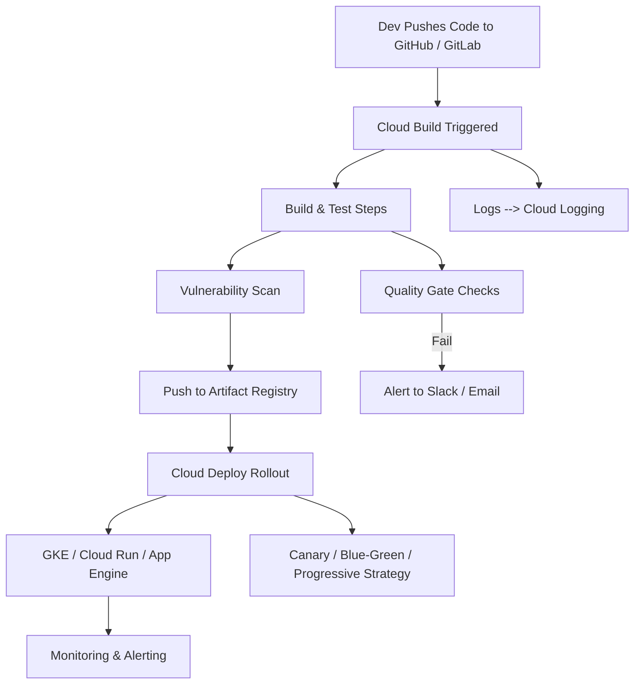

Here's a comprehensive explanation of **CI/CD Pipeline Design and Security** in the context of **GCP Cloud (Cloud Build, Cloud Deploy, GitOps)**, including an **HLD (High-Level Design)** and key components:

---

## ✅ CI/CD Pipeline Design and Security in GCP (with HLD)

Google Cloud provides a **cloud-native CI/CD platform** that enables developers to **automatically build, test, deploy, and secure** applications across environments, using tools like **Cloud Build**, **Cloud Deploy**, **Artifact Registry**, and **GitOps** integrations.

---

### 🔷 1. **CI/CD Pipeline Fundamentals and Architecture**

| Stage                   | Tool/Service                                  | Description                           |
| ----------------------- | --------------------------------------------- | ------------------------------------- |
| **Source Control**      | GitHub, GitLab, Cloud Source Repositories     | Trigger-based source                  |
| **CI (Build)**          | Cloud Build                                   | Automate build, test, scan            |
| **Artifact Management** | Artifact Registry                             | Store and promote Docker images, JARs |
| **CD (Deploy)**         | Cloud Deploy                                  | Safe delivery to GKE, Cloud Run, etc. |
| **Observability**       | Cloud Logging, Monitoring                     | Track pipeline and deployment metrics |
| **Security**            | KMS, Secret Manager, SLSA, Container Analysis | Harden supply chain                   |

> 📌 CI/CD enables **fast, reliable, and secure application releases** through automation, repeatability, and traceability.

---

### 🔷 2. **Cloud Build: Configuration, Triggers, and Steps**

| Feature           | Description                                                                                  |
| ----------------- | -------------------------------------------------------------------------------------------- |
| **Configuration** | `.yaml` file (e.g., `cloudbuild.yaml`) defines build steps                                   |
| **Steps**         | Common steps: build docker image, run tests, scan vulnerabilities, push to Artifact Registry |
| **Triggers**      | Event-based from Git commits, tags, or pull requests                                         |
| **Secrets & IAM** | Secure access to resources using **Secret Manager**, **Workload Identity**, **IAM roles**    |

> ✅ Example trigger: On `main` branch push → build → scan → test → deploy

---

### 🔷 3. **Cloud Deploy: Deployment Strategies and Rollbacks**

| Strategy                 | Support                                                     |
| ------------------------ | ----------------------------------------------------------- |
| **Canary**               | Deploy to subset of users before full rollout               |
| **Blue/Green**           | Zero-downtime swap between prod/staging environments        |
| **Progressive delivery** | Rollout by region or percentage                             |
| **Rollback**             | Automatically revert if health checks fail or SLOs violated |

> 🎯 Integrated with **GKE**, **Cloud Run**, and **Anthos**

---

### 🔷 4. **GitOps Workflows and Best Practices**

| GitOps Principle        | GCP Solution                                              |
| ----------------------- | --------------------------------------------------------- |
| **Declarative configs** | Store Kubernetes YAML/Helm/terraform in Git               |
| **Automated sync**      | Use **Config Sync**, **FluxCD**, or **ArgoCD** for GitOps |
| **Audit & rollback**    | Every deployment is tracked via Git history               |
| **Branch strategy**     | Feature → Dev → Stage → Main (for auto-promote pipelines) |

> ✅ Git becomes the **single source of truth**; tools auto-sync desired state from Git to runtime.

---

### 🔐 5. **Pipeline Security: Secrets Management and Vulnerability Scanning**

| Security Layer             | GCP Tool                                                                  |
| -------------------------- | ------------------------------------------------------------------------- |
| **Secrets**                | **Secret Manager** (referenced in Cloud Build), KMS for encryption        |
| **Vulnerability Scanning** | **Container Analysis API**, **Binary Authorization**, **SLSA Provenance** |
| **IAM Boundaries**         | Granular permissions for Cloud Build and Deploy services                  |
| **Isolation**              | Run builds in **privileged** or **sandboxed** workers                     |

> 🔐 Shift-left security ensures **issues are caught early** in the build pipeline.

---

### 📦 6. **Artifact Management and Promotion**

| Action              | Tool                                             |
| ------------------- | ------------------------------------------------ |
| **Build artifacts** | Cloud Build                                      |
| **Store artifacts** | **Artifact Registry** (Docker, Maven, npm, etc.) |
| **Tag and promote** | Dev → Staging → Prod image promotion             |
| **Access control**  | IAM-based access to repositories                 |

> 🧱 Ensures **only approved and scanned artifacts** reach production.

---

### 📊 7. **Integration with Monitoring and Logging for Pipelines**

| Integration        | Tool                                                               |
| ------------------ | ------------------------------------------------------------------ |
| **Pipeline logs**  | Cloud Logging                                                      |
| **Metrics**        | Cloud Monitoring dashboards for build/deploy times                 |
| **Alerts**         | Notify on failures, latency, test flakiness via Slack, email, etc. |
| **Error tracking** | Error Reporting + Logging queries                                  |

---

### 🧪 8. **Automated Testing and Quality Gates**

| Stage                    | Examples                                                            |
| ------------------------ | ------------------------------------------------------------------- |
| **Unit Tests**           | Run in Cloud Build steps using test frameworks (JUnit, Mocha, etc.) |
| **Linting/Style Checks** | Validate code quality before build                                  |
| **Security Checks**      | Scan dependencies (Snyk, Trivy)                                     |
| **Gate Enforcement**     | Block promotion if tests or scans fail                              |

> ✅ Quality gates maintain **build integrity and policy enforcement**.

---

## 🧩 High-Level Design Diagram (HLD) — GCP CI/CD Architecture

---

## ✅ Summary Table

| CI/CD Layer    | GCP Tool                          | Role                     |
| -------------- | --------------------------------- | ------------------------ |
| Build          | Cloud Build                       | Code → Artifact          |
| Deploy         | Cloud Deploy                      | Rollout with strategy    |
| Source Control | GitHub, GitLab                    | Trigger events           |
| Security       | Secret Manager, SLSA, Binary Auth | Secure pipeline          |
| Observability  | Logging, Monitoring, SLOs         | Visibility & reliability |
| Artifact       | Artifact Registry                 | Store and promote builds |
| Testing        | Integrated in Cloud Build         | Validate and gate        |

---

