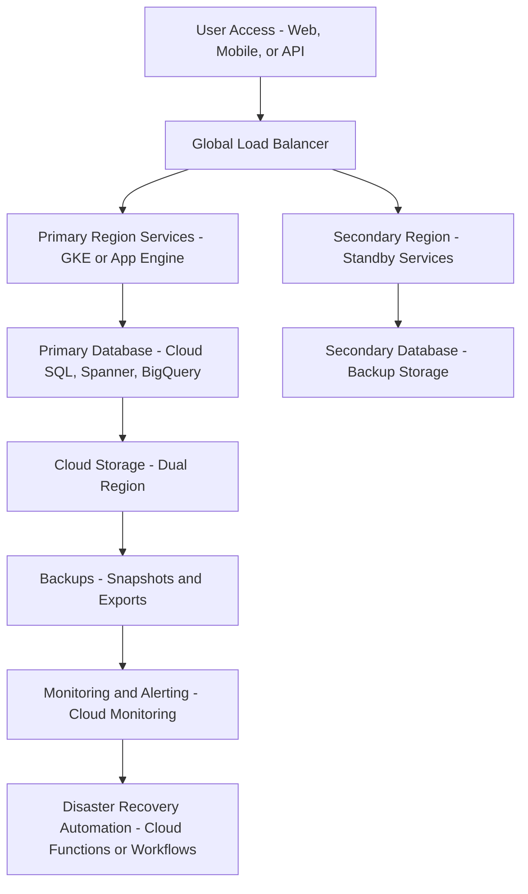

Here’s a comprehensive explanation of **High Availability (HA) and Disaster Recovery (DR) Strategies** in the context of **Google Cloud Platform (GCP)** with an HLD (High-Level Design):

---

## ✅ **High Availability & Disaster Recovery in GCP (with HLD)**

GCP provides native services, architecture patterns, and global infrastructure to implement **robust HA and DR strategies** that support business continuity and meet RTO/RPO targets.

---

### 🔷 1. **Business Continuity Planning (BCP)**

**GCP Practices:**

| Component                     | GCP Capabilities                                                                                                                  |
| ----------------------------- | --------------------------------------------------------------------------------------------------------------------------------- |
| **Multi-region architecture** | Deploy across multiple regions using **Cloud Load Balancing**, **Cloud DNS**, and **GKE Autopilot**                               |
| **Automated failover**        | Use **Cloud SQL HA**, **Spanner**, **Cloud Storage Dual-region**                                                                  |
| **Backup and archival**       | Native **snapshot and backup policies** for **Compute Engine**, **Cloud SQL**, **Filestore**, **Cloud Storage Object Versioning** |
| **Runbooks and playbooks**    | Store and automate recovery workflows with **Cloud Run**, **Cloud Scheduler**, and **Workflows**                                  |

> 🧩 BCP in GCP focuses on designing systems that **can tolerate failures**, **fail fast**, and **recover autonomously** with **automated monitoring and remediation**.

---

### 🔷 2. **Redundancy Design (Failover Systems, Backups)**

**GCP DR Redundancy Options:**

| Redundancy Area | GCP Solutions                                                                                 |
| --------------- | --------------------------------------------------------------------------------------------- |
| **Compute**     | Use **Instance Groups** with health checks and **multi-zonal deployment**                     |
| **Kubernetes**  | **GKE Regional clusters** with automatic node failover                                        |
| **Databases**   | **Cloud SQL HA**, **Spanner**, **Bigtable** with multi-region replication                     |
| **Storage**     | **Multi-regional** or **dual-regional Cloud Storage**, **Filestore backup**                   |
| **Networking**  | **Cloud Load Balancer**, **Cloud Armor** for DDoS protection, **Global CDN**                  |
| **Backups**     | **Cloud SQL Backups**, **Persistent Disk Snapshots**, **Object Lifecycle rules** for archival |

> 💡 Use **infrastructure as code (IaC)** like **Terraform** to create identical environments for failover in secondary regions.

---

### 🔷 3. **Risk Assessment for Regional Threats**

**Strategies:**

| Risk Area                             | Mitigation                                                                                                         |
| ------------------------------------- | ------------------------------------------------------------------------------------------------------------------ |
| **Natural disasters / zone failures** | Use **multi-zonal managed instance groups**, **regional Cloud Storage buckets**, **Spanner**                       |
| **Network outages**                   | Use **Cloud Interconnect redundancy**, **Cloud VPN HA**, and **multi-region private service connect**              |
| **Human error / Data corruption**     | Implement **object versioning**, **continuous export to BigQuery**, and **audit logging** via **Cloud Audit Logs** |

> 🛡️ Risk-aware design is achieved by **region selection**, **resilience testing (Chaos Engineering)**, and **real-time alerting** via **Cloud Monitoring**.

---

### 🔷 4. **RTO and RPO Management**

**Key Definitions:**

* **RTO (Recovery Time Objective):** Maximum acceptable downtime
* **RPO (Recovery Point Objective):** Maximum acceptable data loss

| Scenario                | RTO/RPO Goal              | GCP Solution                                              |
| ----------------------- | ------------------------- | --------------------------------------------------------- |
| **Critical APIs**       | Low RTO & RPO             | **Cloud Load Balancer + GKE + Spanner (multi-region)**    |
| **Analytics Workloads** | Moderate RTO, higher RPO  | **BigQuery**, **batch export from Cloud Storage**         |
| **Transactional DBs**   | Low RPO                   | **Cloud SQL with HA**, **Backups to dual-region storage** |
| **Cold Data**           | High RTO & RPO acceptable | **Archive storage**, **Snapshot recovery**                |

> ✅ Choose **services based on SLAs and data criticality**. GCP provides **SLA-backed services** for <99.99% uptime (e.g., **Spanner**, **Bigtable**, **Cloud Load Balancer**).

---

## 🧩 **High-Level Design Diagram (HA & DR)**

### HLD Overview (Visio-style description):

* **Users → Global Load Balancer**
* **Services deployed in multi-region GKE or App Engine**
* **Data replicated across regions (Cloud SQL HA, Spanner, Cloud Storage)**
* **Monitoring, alerting, automated failover**
* **Backups scheduled and stored cross-region**

---

### ✅ HLD

---

## ✅ Summary Table

| Strategy            | GCP Service                                 | Benefit                    |
| ------------------- | ------------------------------------------- | -------------------------- |
| Business Continuity | GKE, Cloud Load Balancer, Cloud SQL HA      | No single point of failure |
| Redundancy          | Instance groups, multi-zonal deployments    | Fast failover              |
| Risk Mitigation     | Multi-region, Cloud Audit Logs, Cloud Armor | Defense-in-depth           |
| RTO/RPO             | Spanner, Cloud SQL backups, Snapshots       | SLA-bound recovery targets |

---

