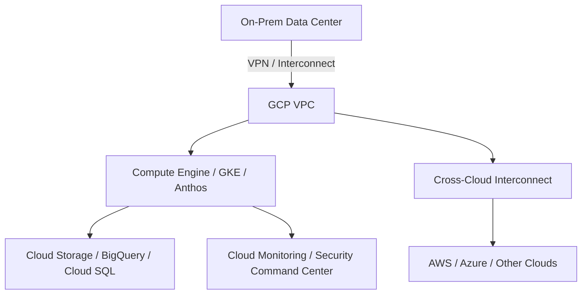

Here is a detailed explanation of **Hybrid and Multi-Cloud Architecture** specifically in the context of **Google Cloud Platform (GCP)**:

---

## ✅ **Hybrid and Multi-Cloud Architecture in GCP**

Google Cloud supports robust hybrid and multi-cloud strategies through a combination of tools, networking services, virtualization capabilities, and security layers. Below are the key components mapped to your points:

---

### 🔹 1. **Network Connectivity (SDN, NFV)**

**GCP Services & Concepts:**

| Technology                                | Description                                                                                                                                                                                                                   |
| ----------------------------------------- | ----------------------------------------------------------------------------------------------------------------------------------------------------------------------------------------------------------------------------- |
| **SDN (Software Defined Networking)**     | Enabled via **VPC (Virtual Private Cloud)**, **Network Intelligence Center**, and **Cloud Router** for dynamic routing and traffic engineering                                                                                |
| **NFV (Network Function Virtualization)** | Implemented using **Cloud NAT**, **Cloud Load Balancing**, **Network Virtual Appliances (NVA)** in partner solutions                                                                                                          |
| **Hybrid Connectivity Options**           | - **Cloud VPN**: Secure IPSec tunnels - **Cloud Interconnect**: Dedicated/Partner Interconnect for low-latency direct links - **Cross-Cloud Interconnect (CCI)**: Connect workloads across AWS, Azure, and other clouds |

> **GCP Example**:
> You can connect your on-premise network to GCP using **Cloud VPN** or **Cloud Interconnect**, and extend routing via **Cloud Router**.

---

### 🔹 2. **Virtualization of Servers and Network Functions**

**GCP Tools:**

| Component                            | GCP Service                                                                                                           |
| ------------------------------------ | --------------------------------------------------------------------------------------------------------------------- |
| **Compute Virtualization**           | **Compute Engine (VMs)**, **GKE (Kubernetes)** for containerized workloads                                            |
| **Network Functions Virtualization** | Marketplace appliances like Palo Alto VM-Series Firewall, F5 Big-IP for DPI, NAT, IPS                                 |
| **Serverless options**               | **Cloud Run**, **App Engine**, and **Cloud Functions** for managed workload execution without managing infrastructure |

> **Use Case**: You can run legacy VMs in Compute Engine and modern apps in containers via **Anthos/GKE**, all connected via a single VPC.

---

### 🔹 3. **Integration of Public/Private Clouds and On-Premises Systems**

**GCP Integration Stack:**

| Type                       | Service                                                                                            |
| -------------------------- | -------------------------------------------------------------------------------------------------- |
| **Hybrid Cloud**           | **Anthos**: Unified platform to run workloads across GCP, on-prem, and other clouds like AWS/Azure |
| **On-Prem Connectivity**   | Cloud VPN, Interconnect, **Migrate to Virtual Machines**                                           |
| **Multi-Cloud Management** | **Anthos Config Management**, **GKE Enterprise**, **Cross-Cloud Interconnect**                     |

> **Real-World Application**: Anthos lets you run Kubernetes clusters on-prem or on AWS, all managed centrally via GCP's control plane.

---

### 🔹 4. **Unified Security and Compliance Frameworks**

**Security Services in GCP:**

| Domain                          | GCP Services                                                                           |
| ------------------------------- | -------------------------------------------------------------------------------------- |
| **Identity & Access**           | **Cloud IAM**, **Workload Identity Federation**, **IAM Recommender**                   |
| **Security Posture Management** | **Security Command Center**, **Policy Intelligence**                                   |
| **Data Protection**             | **Cloud Key Management Service (KMS)**, **Confidential VMs**, **VPC Service Controls** |
| **Compliance Tools**            | **Assured Workloads** for FedRAMP, HIPAA, GDPR, etc.                                   |

> GCP provides **Assured Workloads** to create compliance-specific cloud environments for government and healthcare sectors.

---

### 🧩 Overall Flow (HLD Overview):

---

### ✅ **Benefits of GCP for Hybrid/Multi-Cloud:**

* 🌐 **Anthos** enables seamless multi-cloud Kubernetes management
* 🔒 **Unified IAM and security policies** across clouds and on-prem
* 🧩 **Service mesh** with Istio and Traffic Director
* 📡 **Network insights** with built-in monitoring and VPC flow logs

---

Would you like this explanation and the diagram exported into a **Word document** with GCP branding and a Visio-style visual?
