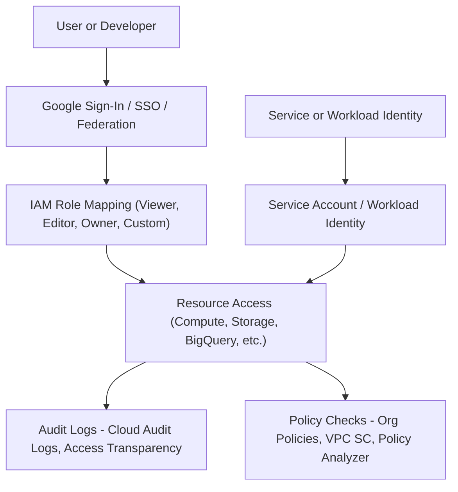

Here is a detailed explanation of **Identity and Access Management (IAM) and Policy Controls in GCP**, along with a **High-Level Design (HLD)**:

---

## ✅ Identity and Access Management (IAM) and Policy Controls in GCP – With HLD

GCP provides a comprehensive IAM system that helps organizations **control who (identity)** has **what access (roles/permissions)** to **which resources (projects/services)**, ensuring security, governance, and regulatory compliance.

---

### 🔷 1. **Role-Based Access Control (RBAC)**

| GCP Feature            | Description                                                                                     |
| ---------------------- | ----------------------------------------------------------------------------------------------- |
| **GCP IAM Roles**      | Grant permissions using **predefined**, **custom**, and **basic roles** (Viewer, Editor, Owner) |
| **Resource hierarchy** | IAM applies at the **Organization → Folder → Project → Resource** levels                        |
| **IAM Recommender**    | Suggests least-privilege permissions based on actual usage                                      |
| **Principals**         | Can be users, service accounts, groups, or external identities                                  |

> ✅ GCP enforces **least-privilege access** through structured RBAC and scoped roles at different levels of the hierarchy.

---

### 🔷 2. **Authentication Methods (Multi-Factor, Biometrics)**

| Method                                | GCP Tool/Support                                                                                                                                 |
| ------------------------------------- | ------------------------------------------------------------------------------------------------------------------------------------------------ |
| **2-Step Verification**               | Enforced via **Google Workspace** or **Cloud Identity**                                                                                          |
| **Multi-Factor Authentication (MFA)** | Required for **high-trust accounts and admin roles**                                                                                             |
| **Biometric login**                   | Not directly provided by GCP, but supported via **SAML/OIDC integration** with platforms like Okta, Azure AD, or biometrics through device trust |
| **Federated identity**                | Use **Workload Identity Federation** and **SSO with Identity Providers (IdPs)** like ADFS, Okta                                                  |

> 🔐 GCP supports **identity federation and MFA enforcement**, improving login security across services.

---

### 🔷 3. **Machine Identity Management for APIs/Devices**

| Use Case                    | GCP Service                                                                                  |
| --------------------------- | -------------------------------------------------------------------------------------------- |
| **Service-to-service auth** | **Service Accounts + IAM Roles**                                                             |
| **API-based workloads**     | **Workload Identity Federation**, **OAuth 2.0**, **API Keys with restrictions**              |
| **IoT device identity**     | **Cloud IoT Core** (deprecated), use **Pub/Sub + custom IAM or third-party solutions**       |
| **Kubernetes workloads**    | **Workload Identity for GKE** (binds pods to IAM roles securely without storing credentials) |

> 🤖 GCP allows **secure machine identity authentication** without needing long-lived secrets.

---

### 🔷 4. **Identity Governance and Policy Auditing**

| Governance Need           | GCP Service                                                            |
| ------------------------- | ---------------------------------------------------------------------- |
| **IAM visibility**        | **IAM Policy Analyzer**, **Policy Troubleshooter**                     |
| **Audit logging**         | **Cloud Audit Logs**, **Access Transparency**, **Admin Activity Logs** |
| **Policy enforcement**    | **Organization Policy Service**, **VPC Service Controls**              |
| **Compliance monitoring** | **Cloud Asset Inventory**, **Security Command Center**                 |

> 📋 Use these tools to **audit access**, **detect anomalies**, and **enforce compliance** at scale.

---

## 🧩 High-Level Design Diagram (HLD) — IAM & Policy Controls (Visio-style logic)

### Components:

* Centralized identity provider
* GCP IAM & policy layer
* Application/API authentication
* Logging and auditing mechanisms
* Integration with CI/CD for secure deployments

---

### ✅ IAM HLD

---

## ✅ Summary Table

| Area           | GCP Feature                         | Purpose                    |
| -------------- | ----------------------------------- | -------------------------- |
| RBAC           | IAM Roles, IAM Recommender          | Assign fine-grained access |
| Authentication | MFA, 2SV, Identity Federation       | Secure logins              |
| Machine Access | Workload Identity, Service Accounts | Secure non-human access    |
| Governance     | Audit Logs, Policy Analyzer, SCC    | Track and enforce access   |

---
