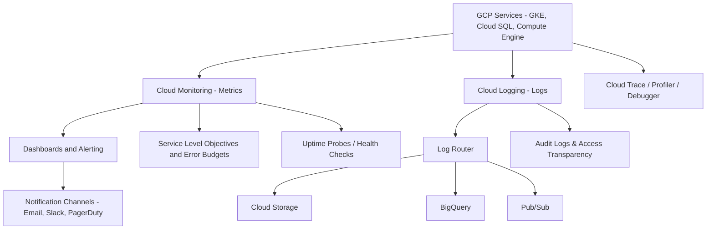

Here’s a comprehensive explanation of **Monitoring, Logging, and Observability in GCP Cloud Operations Suite**, with a corresponding **High-Level Design (HLD)**.

---

## ✅ Monitoring, Logging, and Observability in GCP – With HLD

GCP provides a powerful **Cloud Operations Suite (formerly Stackdriver)** to help developers and operators monitor performance, ensure reliability, debug applications, and meet service-level goals across hybrid and multi-cloud environments.

---

## 🔍 Overview of Google Cloud Observability Suite

The **Cloud Operations Suite** includes:

| Component            | Function                                    |
| -------------------- | ------------------------------------------- |
| **Cloud Monitoring** | Collects, visualizes, and alerts on metrics |
| **Cloud Logging**    | Ingests, stores, and analyzes logs          |
| **Cloud Trace**      | Latency tracing across distributed apps     |
| **Cloud Profiler**   | CPU/memory usage profiling                  |
| **Cloud Debugger**   | Real-time debugging of running apps         |
| **Error Reporting**  | Tracks and groups runtime errors            |

---

### 📊 1. **Cloud Monitoring: Metrics Collection and Dashboards**

* Automatically collects system and service metrics from:

  * GCP resources (e.g., Compute Engine, Cloud SQL, GKE)
  * Custom apps via **OpenTelemetry**
  * **Prometheus-compatible exporters**
* Create **dashboards** to visualize metrics and trends
* Set **alerting policies** on metrics thresholds

> ✅ Example: Monitor GKE pod memory usage or Pub/Sub message backlog.

---

### 📜 2. **Cloud Logging: Ingestion, Management, and Analysis**

* Centralized log collection from:

  * GCP services (e.g., Cloud Run, GKE, VMs)
  * Custom apps via Logging API
* **Log Explorer** for querying logs (based on structured JSON)
* **Log retention policies**, **bucketed storage**, and **access controls**

> ✅ Search for HTTP 5xx errors across GKE workloads or trace user activity via logs.

---

### 🔁 3. **Log Router and Export Destinations**

| Destination          | Use Case                                                   |
| -------------------- | ---------------------------------------------------------- |
| **Cloud Storage**    | Long-term archival                                         |
| **BigQuery**         | Advanced analysis and correlation                          |
| **Pub/Sub**          | Stream logs to third-party tools like Splunk, Datadog      |
| **SIEM Integration** | Export logs to Chronicle or third-party security platforms |

> 🔄 Route logs using **filters, sinks, and resource selectors**.

---

### 🚨 4. **Alerting Policies and Notification Channels**

* Define alert conditions based on:

  * System metrics
  * Uptime checks
  * Custom metrics or logs
* Configure channels like:

  * **Email**
  * **Slack**
  * **PagerDuty**
  * **Webhook**
* Use **Incident Response Management** via **Opsgenie, ServiceNow**, or **GCP integrations**

---

### 🎯 5. **Service Level Objectives (SLOs) and Error Budgets**

* Define **SLOs** for services (e.g., 99.9% uptime)
* Measure **SLIs** like availability, latency
* **Error budgets** track SLO burn rates
* Integrate with alerting for **proactive action**

> ✅ Helps enforce **SRE practices** and track reliability.

---

### ⚙️ 6. **Application Performance Management (APM)**

| APM Tool            | Function                                       |
| ------------------- | ---------------------------------------------- |
| **Cloud Trace**     | Distributed latency tracing                    |
| **Cloud Profiler**  | Sampling-based CPU/memory profiling            |
| **Cloud Debugger**  | Attach live debugger to apps in prod           |
| **Error Reporting** | Group and alert on unhandled exceptions/errors |

---

### 📈 7. **Integration with Prometheus and Third-Party Tools**

* Native **Prometheus** support for GKE Autopilot and standard clusters
* Integrate with:

  * **Grafana**
  * **Splunk**
  * **Elastic**
  * **Datadog**
  * **PagerDuty**
* Use **OpenTelemetry Collector** for hybrid/multi-cloud observability

---

### 🩺 8. **Health Checks, Uptime Probes, and Synthetic Monitoring**

* **Uptime checks**: Validate endpoint availability from global probes
* **Health checks**: Used for load balancing & failover logic
* **Synthetic Monitoring**: Create test probes for business-critical endpoints

---

### 🔐 9. **Security and Audit Logging**

| Logging Type            | Source                                                  |
| ----------------------- | ------------------------------------------------------- |
| **Admin Activity Logs** | IAM changes, project modifications                      |
| **Data Access Logs**    | Who read/wrote to data                                  |
| **System Events**       | GCP infrastructure operations                           |
| **Access Transparency** | Google support access logs (for regulated environments) |

> ✅ Logs routed to **SIEM** tools or **Cloud SCC** for security insights.

---

### 💰 10. **Cost and Performance Optimization Using Observability**

* Use **Cloud Monitoring** to detect over-provisioned VMs, idle services
* Create dashboards for:

  * **CPU/memory trends**
  * **Storage growth**
  * **Network traffic anomalies**
* Set alerts for:

  * Budget thresholds
  * Unused resources
  * High API costs (e.g., BigQuery queries)

---

## 🧩 High-Level Design Diagram (HLD) – GCP Observability Suite

---

## ✅ Summary Table

| Component            | Tool                            | Benefit                              |
| -------------------- | ------------------------------- | ------------------------------------ |
| Metrics & Dashboards | Cloud Monitoring                | Real-time insights                   |
| Logging & Export     | Cloud Logging, Log Router       | Centralized log mgmt                 |
| APM                  | Trace, Profiler, Debugger       | App-level diagnostics                |
| Alerts               | Alerting policies               | Immediate response                   |
| SLOs                 | SLI/SLO/Error Budget            | Reliability tracking                 |
| Security             | Audit Logs, Access Transparency | Regulatory compliance                |
| Export               | Pub/Sub, BQ, GCS                | SIEM/retention/analytics integration |

---

