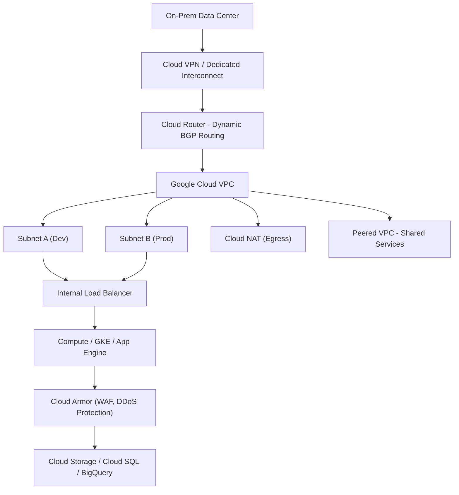

Here is a detailed explanation of **Network Architecture and Routing in GCP**, including a High-Level Design (HLD), architecture components, and best practices relevant to SDN, VPC peering, VPN/Interconnect, and NFV:

---

## ✅ Network Architecture and Routing in GCP (with HLD)

GCP’s networking backbone is **fully software-defined**, global, scalable, and supports hybrid and multi-cloud connectivity with granular control over traffic routing, firewalling, and service accessibility.

---

### 🌐 1. **Software-Defined Networking (SDN)**

| Concept              | GCP Implementation                                                                                        |
| -------------------- | --------------------------------------------------------------------------------------------------------- |
| **SDN Core**         | GCP uses **Andromeda**, Google’s SDN platform, to virtualize network layers                               |
| **Traffic Control**  | Centralized control with **Cloud Load Balancing**, **Cloud Router**, and **IAM-based controls**           |
| **Dynamic Routing**  | Configurable via **Cloud Router**, enabling **BGP** for real-time routing updates between GCP and on-prem |
| **Network Insights** | **Network Intelligence Center** offers real-time visibility into performance, topology, and health        |

> 📌 SDN allows GCP to offer **flexible IP management**, **subnet allocation**, and **dynamic policy enforcement** across regions/zones.

---

### 🔗 2. **Virtual Private Cloud (VPC) Peering**

| Feature                | GCP Tool                                                                                                              |
| ---------------------- | --------------------------------------------------------------------------------------------------------------------- |
| **VPC Peering**        | Private connection between **two VPCs**, even across projects or organizations                                        |
| **Shared VPC**         | Enables **centralized control** where multiple projects share the same VPC                                            |
| **Transitive Routing** | Not supported in native VPC Peering — design requires **hub-and-spoke** or **Cloud Interconnect** for mesh topologies |
| **Hybrid Networks**    | Seamless routing with **on-prem networks via VPN/Interconnect**                                                       |

> 🔄 VPC peering provides **low-latency, high-bandwidth** connectivity with **no single point of failure** across GCP projects.

---

### 🔒 3. **VPN and Interconnect Solutions**

| Use Case                           | GCP Solution                                                                            |
| ---------------------------------- | --------------------------------------------------------------------------------------- |
| **Site-to-Site VPN**               | **Cloud VPN** with **IKEv2**, supports dynamic (BGP) or static routes                   |
| **Dedicated private connectivity** | **Dedicated Interconnect** (10/100 Gbps) and **Partner Interconnect** (50 Mbps–10 Gbps) |
| **Failover design**                | Use **HA VPN** or redundant Interconnects with SLAs                                     |
| **Hybrid Routing**                 | Integrate with **Cloud Router** for dynamic routing to/from on-premises                 |

> 🛡️ These solutions enable **secure hybrid cloud connectivity** with high availability and compliance-grade latency.

---

### 🔥 4. **Network Function Virtualization (NFV)**

| Function            | GCP NFV Equivalent                                                                              |
| ------------------- | ----------------------------------------------------------------------------------------------- |
| **Firewall**        | **VPC Firewall Rules**, **Hierarchical Firewall**, **Cloud Armor** (L7)                         |
| **Load Balancer**   | **Global HTTP(S) Load Balancing**, **Internal Load Balancing**, **TCP/UDP Proxy Load Balancer** |
| **NAT Gateway**     | **Cloud NAT** for secure outbound internet access without public IPs                            |
| **DDoS Protection** | **Cloud Armor with Threat Intelligence** and **Edge caching via CDN**                           |

> 🧩 GCP's NFV model **removes the need for physical appliances** by virtualizing key network functions as **fully managed services**.

---

## 🧩 High-Level Design (HLD) — GCP Network Architecture

### ✅ Logical Architecture Flow

---

### ✅ Summary Table

| Area                | GCP Services Used          | Benefit                                    |
| ------------------- | -------------------------- | ------------------------------------------ |
| SDN                 | Andromeda, Cloud Router    | Programmable routing, dynamic scale        |
| VPC Peering         | VPC Peering, Shared VPC    | Internal connectivity with IAM isolation   |
| Hybrid Connectivity | Cloud VPN, Interconnect    | Secure & low-latency on-prem to cloud link |
| NFV                 | Cloud NAT, Cloud Armor, LB | Virtual network functions at scale         |

---

### 📌 Best Practices:

* Use **Shared VPCs** for centralized security and IAM governance
* Leverage **Cloud NAT** for secure outbound access
* Implement **HA VPN or dual Interconnects** for redundancy
* Apply **hierarchical firewalls** for organization-wide network policies
* Use **Private Google Access** to securely access Google APIs from internal IPs

---

