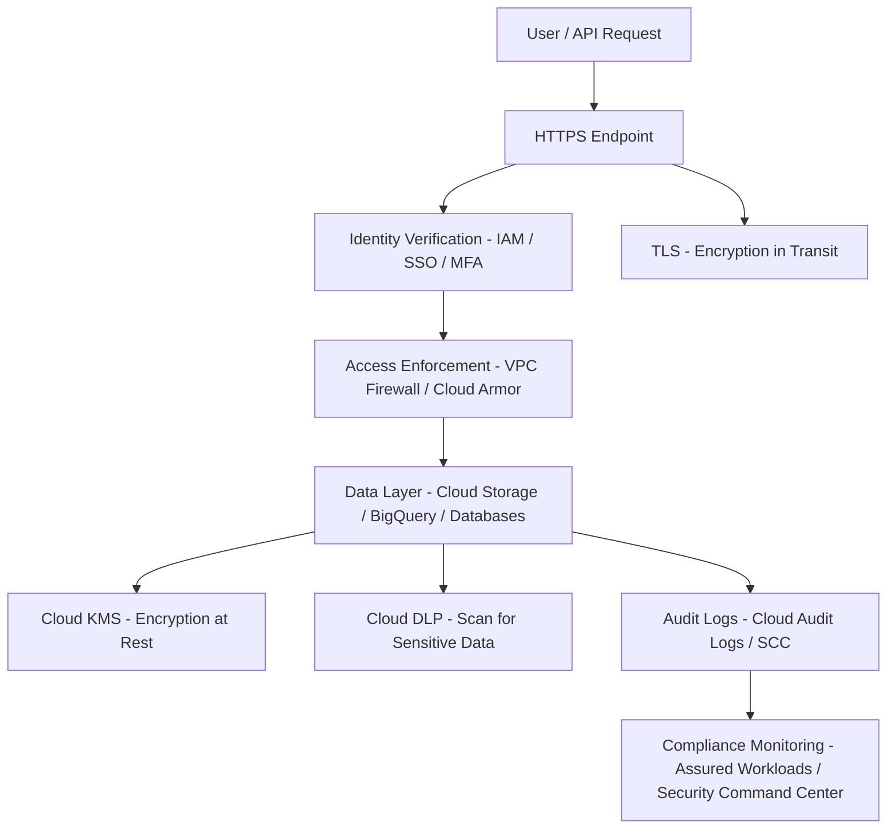

**Security and Compliance Design** in the context of **Google Cloud Platform (GCP)**, including a High-Level Design (HLD) and tools used across security domains

---

## ✅ Security and Compliance Design in GCP (with HLD)

Security and compliance in GCP are implemented through a **layered defense model**, enabling data protection, access control, network security, and auditability—critical for regulated industries (e.g., healthcare, finance, government).

---

### 🔐 1. **Data Loss Prevention (DLP) & Encryption (at rest, in transit)**

| Security Mechanism             | GCP Implementation                                                                                                         |
| ------------------------------ | -------------------------------------------------------------------------------------------------------------------------- |
| **Encryption at Rest**         | Automatically applied using **Google-managed keys**, **Customer-managed keys (CMEK)**, or **Customer-supplied keys (CSK)** |
| **Encryption in Transit**      | **TLS 1.2+** is enforced by default between services and APIs                                                              |
| **DLP (Data Loss Prevention)** | Use **Cloud DLP** to classify, inspect, and redact sensitive data such as **PII**, **PHI**, **credit card numbers**        |
| **Field-level encryption**     | Supported via **Cloud KMS API integration** with **BigQuery**, **Cloud Storage**, **Pub/Sub**                              |

> ✅ You can scan storage buckets and BigQuery datasets for sensitive data using **Cloud DLP**, then take actions like redaction or tokenization.

---

### 🔑 2. **Key Lifecycle Management (Rotation, Expiration)**

| Feature                      | GCP Service                                                                           |
| ---------------------------- | ------------------------------------------------------------------------------------- |
| **Key Management**           | **Cloud Key Management Service (Cloud KMS)** for managing symmetric/asymmetric keys   |
| **Automatic Rotation**       | Schedule key rotation at defined intervals (e.g., every 90 days) via **Cloud KMS**    |
| **Expiration policies**      | Define TTL for keys and enforce expiration for compliance                             |
| **Hardware-backed security** | Use **Cloud HSM** or **External Key Manager (EKM)** for FIPS 140-2 Level 3 compliance |

> 🔁 Cloud KMS supports **automatic and manual rotation**, ensuring keys remain valid and secure during their lifecycle.

---

### 🧑‍⚖️ 3. **Compliance Monitoring for Regulated Industries**

| Industry Requirement                   | GCP Tools                                                                                                     |
| -------------------------------------- | ------------------------------------------------------------------------------------------------------------- |
| **HIPAA, PCI-DSS, FedRAMP, ISO 27001** | Supported via **Assured Workloads**, which enforces data residency, support access, and compliance boundaries |
| **Audit trails**                       | **Cloud Audit Logs**, **Access Transparency**, **Admin Activity logs**                                        |
| **Security posture monitoring**        | **Security Command Center Premium**, **Policy Intelligence**                                                  |
| **Asset Inventory**                    | **Cloud Asset Inventory**, **Cloud SCC asset discovery**                                                      |

> 🧩 With **Assured Workloads**, GCP enforces compliance controls at the project level, helping meet healthcare, financial, and public sector regulations.

---

### 🔥 4. **Virtual Firewall Configurations**

| Component                  | GCP Tool                                                                     |
| -------------------------- | ---------------------------------------------------------------------------- |
| **Virtual firewalls**      | **VPC Firewall Rules** applied at subnet or instance level                   |
| **Ingress/Egress Control** | Define **allow/deny rules** based on tags, service accounts, CIDR ranges     |
| **Hierarchical Firewall**  | Centralized enforcement at **organization/folder/project** levels            |
| **Web Security Layer**     | Use **Cloud Armor** for L7 DDoS protection and **Threat Intelligence rules** |

> 🚦 Firewall rules in GCP are **stateful**, **priority-based**, and can be **audited via Logging and Policy Analyzer**.

---

## 🧩 High-Level Design (HLD) – Security & Compliance in GCP

### ✅ Logical Flow: How Security Components Interact

---

## ✅ Summary Table

| Area             | GCP Service               | Benefit                                   |
| ---------------- | ------------------------- | ----------------------------------------- |
| Data Protection  | Cloud KMS, DLP, TLS       | Secure data at all stages                 |
| Key Management   | Cloud KMS, HSM, EKM       | Automate and control key lifecycle        |
| Compliance       | Assured Workloads, SCC    | Enforce controls for HIPAA, FedRAMP, etc. |
| Network Security | VPC Firewall, Cloud Armor | Control and monitor traffic at all layers |

---

