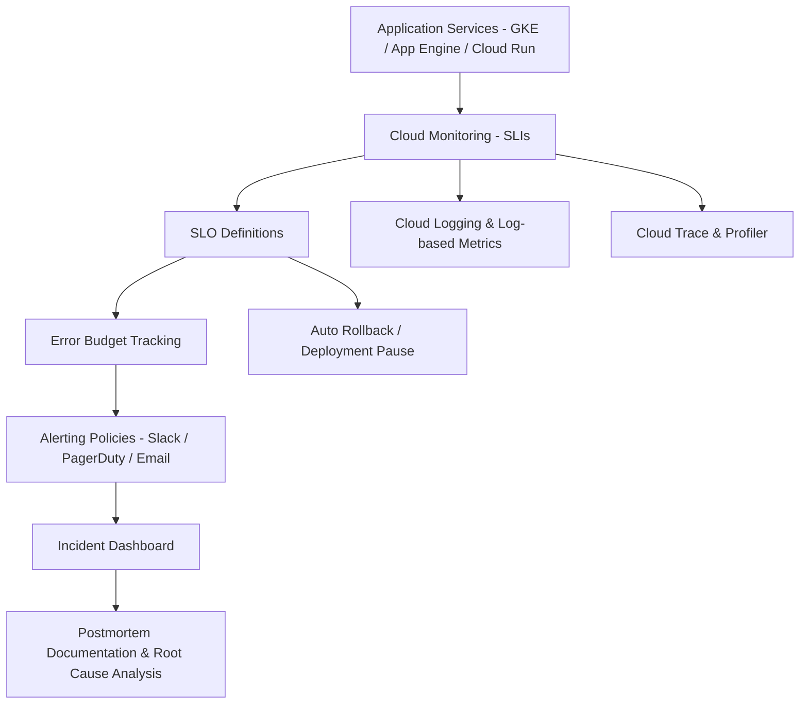

Here is a complete explanation of **Site Reliability Engineering (SRE) Practices in GCP Cloud**, with practical applications and a **High-Level Design (HLD)**.

---

## ✅ Site Reliability Engineering (SRE) in GCP (with HLD)

**Site Reliability Engineering (SRE)** in GCP is a discipline that applies software engineering principles to infrastructure and operations problems, with a strong focus on **automation, observability, incident response**, and **reliability governance** using **SLIs, SLOs, and error budgets**.

---

### 🔷 1. **Introduction to SRE Principles**

| SRE Pillar                     | Purpose                                         |
| ------------------------------ | ----------------------------------------------- |
| **SLI/SLO/Error Budgets**      | Quantify and enforce service reliability        |
| **Monitoring & Observability** | Real-time insights and root-cause diagnosis     |
| **Incident Management**        | Rapid mitigation with postmortem culture        |
| **Toil Reduction**             | Minimize repetitive manual tasks via automation |
| **Release Engineering**        | Safe, progressive deployment strategies         |
| **Capacity Planning**          | Forecast demand and prevent overloads           |

> 🔁 GCP integrates SRE practices into Cloud Operations (Monitoring, Logging, Alerting), Cloud Deploy, and policy enforcement.

---

### 📏 2. **Defining and Measuring Service Level Indicators (SLIs)**

| Metric           | Example                                    |
| ---------------- | ------------------------------------------ |
| **Availability** | 99.95% uptime over 30 days                 |
| **Latency**      | < 300 ms response time for 95% of requests |
| **Throughput**   | 1000+ successful req/sec                   |
| **Error Rate**   | < 1% HTTP 5xx errors                       |

**In GCP:**

* Use **Cloud Monitoring** to collect SLIs
* Define custom SLIs via **Monitoring Query Language (MQL)** or **Prometheus exporters**

---

### 🎯 3. **Setting Service Level Objectives (SLOs)**

| Target               | Example                                      |
| -------------------- | -------------------------------------------- |
| **Availability SLO** | Service must be available 99.9% over 30 days |
| **Latency SLO**      | 95% of requests under 300ms                  |
| **Error Budget**     | 0.1% unavailability allowed per month        |

**Tooling in GCP:**

* Define **SLOs** in **Cloud Monitoring**
* Visualize burn rate, alert on SLO violations

---

### ⚖️ 4. **Managing Error Budgets (Balancing Reliability vs. Velocity)**

| Principle                                              | Outcome                                |
| ------------------------------------------------------ | -------------------------------------- |
| **Error Budget** = 100% - SLO target                   |                                        |
| Example: 99.9% SLO → 0.1% budget for failure per month |                                        |
| **Too many errors**                                    | Stop feature rollouts; fix reliability |
| **Healthy budget**                                     | Ship features faster                   |

> GCP allows SLO burn-rate monitoring to **automate policy-driven rollbacks or gate deployments.**

---

### 🚨 5. **Incident Response and Blameless Postmortems**

| Practice               | GCP Implementation                                                     |
| ---------------------- | ---------------------------------------------------------------------- |
| **Real-time alerting** | Cloud Monitoring alerts, integrated with PagerDuty, Slack, etc.        |
| **Incident tracking**  | Third-party ITSM (ServiceNow) or **Cloud Logging-based dashboards**    |
| **Postmortems**        | Use templates and integrate into Confluence, Git, or Docs for analysis |
| **No-blame culture**   | Focus on system/process, not individuals                               |

> 📘 GCP promotes **structured incident documentation and fast feedback loops**.

---

### 🤖 6. **Automation and Toil Reduction**

| Task                          | GCP Tool                                               |
| ----------------------------- | ------------------------------------------------------ |
| **Infra provisioning**        | Terraform, Deployment Manager                          |
| **Auto-scaling**              | GKE HPA, Instance Groups                               |
| **Self-healing**              | Managed instance groups with health checks             |
| **Monitoring config as code** | Use **YAML-based SLO policies** and integrate with Git |

> 🔁 SRE aims to **automate all operational tasks that are manual, repetitive, and automatable.**

---

### 📊 7. **Monitoring Reliability Metrics**

| Metric Type               | Tool                             |
| ------------------------- | -------------------------------- |
| **SLI dashboards**        | Cloud Monitoring                 |
| **Error budget tracking** | Cloud Monitoring SLO widgets     |
| **Trace & latency**       | Cloud Trace                      |
| **CPU/memory**            | Cloud Monitoring, GKE Metrics    |
| **Log analysis**          | Cloud Logging, Log-based metrics |

---

## 🧩 High-Level Design Diagram (HLD) – SRE on GCP

---

## ✅ Summary Table

| SRE Area      | GCP Capability              | Purpose                       |
| ------------- | --------------------------- | ----------------------------- |
| SLIs          | Cloud Monitoring            | Define availability/latency   |
| SLOs          | Cloud Monitoring            | Track service goals           |
| Error Budgets | Burn rate alerts            | Control release velocity      |
| Incident Mgmt | Alerts + Logs + Dashboards  | Detect and resolve failures   |
| Observability | Logging, Tracing, Profiling | Root cause visibility         |
| Automation    | Terraform, HPA, Deploy      | Minimize toil, increase speed |

---

