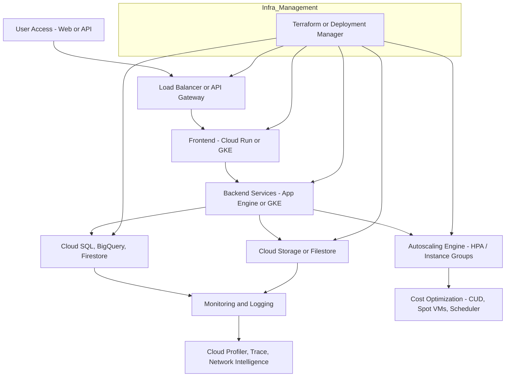

Here is a detailed **GCP-based High-Level Design (HLD)** explanation for the topic:

---

## ✅ **Solution Infrastructure Planning and Optimization (GCP Cloud - HLD)**

This high-level design focuses on building an **optimized, scalable, and cost-efficient infrastructure** using **Google Cloud Platform (GCP)** services. The solution aligns with cloud best practices in:

* **Resource consolidation**
* **Automation for scaling**
* **Performance benchmarking**
* **Cost control and efficiency**

---

### 🔷 1. **Resource Consolidation & Virtualization**

**Objective:** Reduce complexity and cost by consolidating infrastructure using GCP-native compute services.

| Strategy                                   | GCP Services                                                                                 |
| ------------------------------------------ | -------------------------------------------------------------------------------------------- |
| **VM consolidation**                       | Use **Compute Engine** instance groups with autoscaling and custom machine types             |
| **Containerization**                       | Deploy microservices via **Google Kubernetes Engine (GKE)** or **Cloud Run**                 |
| **Network functions virtualization (NFV)** | Replace hardware appliances with **Cloud Load Balancing**, **Cloud NAT**, **Firewall Rules** |
| **Centralized storage**                    | Use **Cloud Storage**, **Filestore**, and **Persistent Disks** with regional replication     |

> ✅ Benefit: Fewer compute instances, better hardware utilization, and simplified network configuration.

---

### 🔷 2. **Automation Technologies for Workload Scaling**

**Objective:** Enable the platform to **scale workloads automatically** based on demand.

| Automation                       | GCP Feature                                                           |
| -------------------------------- | --------------------------------------------------------------------- |
| **Horizontal Pod Autoscaler**    | For **GKE** deployments                                               |
| **Compute Autoscaler**           | For VM instance groups with CPU/memory metrics                        |
| **Cloud Functions / Cloud Run**  | Fully serverless and scale-to-zero                                    |
| **Infrastructure as Code (IaC)** | Use **Terraform** or **Deployment Manager** for resource provisioning |
| **Event-driven triggers**        | Pub/Sub + Cloud Functions for auto-processing workloads               |

> ✅ Benefit: Hands-free autoscaling ensures high availability and responsiveness with minimal manual intervention.

---

### 🔷 3. **Performance Benchmarking & Bottleneck Analysis**

**Objective:** Measure, analyze, and optimize system performance.

| Tool                                 | Purpose                                                     |
| ------------------------------------ | ----------------------------------------------------------- |
| **Cloud Monitoring + Cloud Logging** | Real-time metrics and logs for compute, storage, networking |
| **Cloud Profiler**                   | Analyze CPU/memory usage in applications                    |
| **Cloud Trace**                      | Distributed tracing for latency issues                      |
| **Cloud Debugger**                   | Real-time debugging of deployed code                        |
| **Network Intelligence Center**      | Analyze latency, packet loss, routing paths                 |

> ✅ Benefit: Identify slow components, optimize queries, reduce latency, and remove memory/cpu bottlenecks.

---

### 🔷 4. **Cost-effective Scalability Strategies**

**Objective:** Scale only when required, reduce costs through smart resource usage.

| Strategy                                     | GCP Feature                                         |
| -------------------------------------------- | --------------------------------------------------- |
| **Committed use discounts (CUDs)**           | Buy 1- or 3-year committed usage for VMs, databases |
| **Preemptible VMs / Spot VMs**               | Short-lived, highly-discounted instances            |
| **Idle resource alerting**                   | Monitoring dashboards + budget alerts               |
| **BigQuery flat-rate plans or reservations** | Optimize query cost and slot usage                  |
| **Cloud Scheduler + Automation**             | Schedule shutdown/startup of non-critical VMs       |

> ✅ Benefit: Optimize every dollar spent without compromising performance or availability.

---

## 🔷 HLD (High-Level Design Diagram – Visio-style Description)

### Components:

* **Users** access via Web UI/API Gateway
* **Frontend & Backend Services** run in GKE / Cloud Run
* **Databases & Object Storage** via Cloud SQL, BigQuery, Cloud Storage
* **Autoscaling Logic** embedded in deployment configuration
* **Monitoring, Logging, Security** integrated with cross-cutting services

---

### 📌 HLD Overview 

## ✅ Summary Table

| Optimization Area     | GCP Services Used              | Benefit                   |
| --------------------- | ------------------------------ | ------------------------- |
| Compute Consolidation | GKE, Cloud Run, Compute Engine | Efficiency, manageability |
| Auto-scaling          | HPA, Instance Groups, Pub/Sub  | Demand-based scaling      |
| Benchmarking          | Profiler, Trace, Monitoring    | Performance visibility    |
| Cost Optimization     | Spot VMs, CUDs, Scheduler      | Lower TCO                 |

---

Would you like this content exported into a **Word document** with a high-resolution Visio-style diagram?
