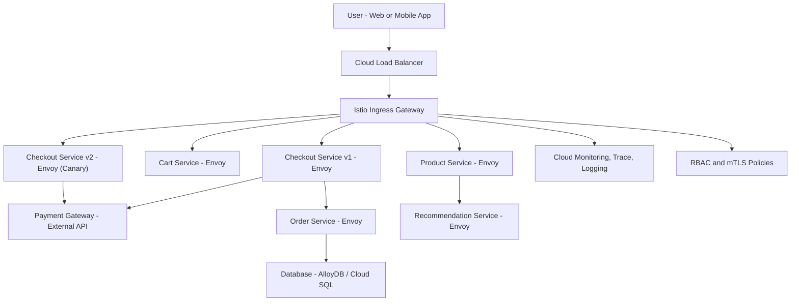

Here is a detailed explanation of **why and how Istio (via Anthos Service Mesh)** is used in **GCP retail/e-commerce business scenarios**, with **real-world examples** and a **Mermaid-based High-Level Design (HLD)**.

---

## ✅ Why Use **Istio in GCP** for Retail/E-Commerce

### 🧾 Business Background:

Retail systems often include many **microservices** for:

* Product browsing
* User accounts
* Cart & checkout
* Payment gateways
* Order management
* Analytics & recommendations

As these services **scale and evolve**, you need:

* **Traffic control**
* **Security** (especially PCI-DSS compliance)
* **Zero-downtime deployments**
* **Real-time observability**

That’s where **Istio (Anthos Service Mesh)** plays a critical role.

---

## 🎯 Istio Benefits Mapped to Retail Needs

| Retail Requirement                        | Istio Feature Used                     |
| ----------------------------------------- | -------------------------------------- |
| Route 10% traffic to new checkout version | `VirtualService` traffic splitting     |
| Encrypt service-to-service traffic        | `PeerAuthentication` with mTLS         |
| Retry on payment gateway timeout          | `DestinationRule` (retries, timeouts)  |
| Trace slow product loading                | `Cloud Trace`, `Envoy`, `Kiali`        |
| Only cart can talk to checkout            | `AuthorizationPolicy` RBAC             |
| Canary rollout based on headers           | `VirtualService` with `match` rules    |
| API Gateway integration                   | Ingress Gateway with JWT validation    |
| CI/CD + GitOps for config deployment      | YAML-based mesh config (stored in Git) |

---

## 🛍️ Real-World Retail Use Case with Istio on GCP

**Scenario:**
You're modernizing an e-commerce platform hosted on **GKE** with multiple microservices, and want to:

* Roll out **checkout-v2** for testing
* Monitor latency spikes
* Enforce that **only** `cart-service` talks to `checkout-service`

---

## 🧩 High-Level Design (HLD) – Retail + Istio on GCP

### Mermaid Diagram (Istio in Retail E-Commerce)



---

## 🔧 Istio Configuration Snippets

### 🔹 Canary Deployment

```yaml
apiVersion: networking.istio.io/v1alpha3
kind: VirtualService
metadata:
  name: checkout-route
spec:
  hosts:
    - checkout.example.com
  http:
    - route:
        - destination:
            host: checkout-v1
          weight: 90
        - destination:
            host: checkout-v2
          weight: 10
```

---

### 🔹 Enforce mTLS

```yaml
apiVersion: security.istio.io/v1beta1
kind: PeerAuthentication
metadata:
  name: default
spec:
  mtls:
    mode: STRICT
```

---

### 🔹 RBAC Policy – Only Cart Can Talk to Checkout

```yaml
apiVersion: security.istio.io/v1beta1
kind: AuthorizationPolicy
metadata:
  name: checkout-access
spec:
  selector:
    matchLabels:
      app: checkout
  rules:
  - from:
    - source:
        principals: ["cluster.local/ns/retail/sa/cart-service"]
```

---

## 🧪 Observability Dashboard (SRE View)

* See top latency flows in **Cloud Trace**
* Alert if checkout 500 errors > 1% (via log-based metric)
* Use **Kiali** for service dependency visualization
* Use **Grafana** for cart throughput dashboards

---

## ✅ Summary

| Use Case                 | Istio Value Delivered        |
| ------------------------ | ---------------------------- |
| Canary Testing           | Controlled rollout           |
| PCI-DSS Compliance       | mTLS + identity-based policy |
| SRE Monitoring           | Full tracing, logging        |
| Dynamic Traffic Steering | Load-split, retries          |
| Secure API Gateway       | JWT + mTLS                   |

---


