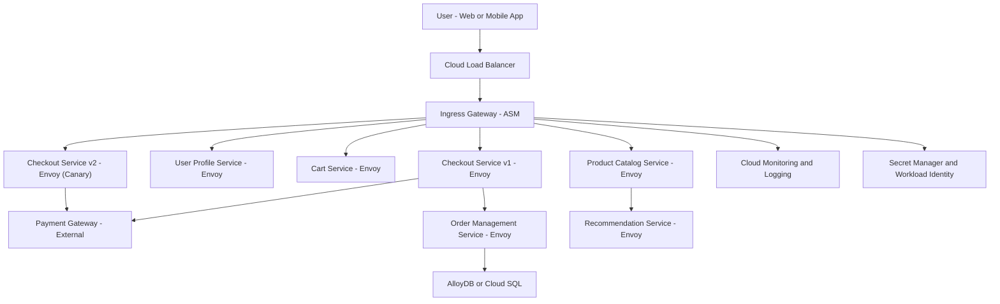

Here is a **complete explanation** of how and **why to use Service Mesh in GCP** (Anthos Service Mesh) in a **retail/e-commerce business**, including a **real-world example with a High-Level Design (HLD)** in both **explanation and Mermaid diagram form**.

---

## ✅ **Service Mesh in GCP for Retail/E-Commerce – Explained with HLD**

---

### 🛒 **Business Scenario:**

You're building or modernizing an **e-commerce platform** on **Google Cloud**, where your application is composed of the following **microservices**:

* `Frontend UI`
* `Product Catalog`
* `User Profile`
* `Cart & Checkout`
* `Payment Service`
* `Order Management`
* `Recommendation Engine`

These services need to **communicate securely, reliably**, and **efficiently**, while supporting:

* Real-time observability
* Canary releases (v1/v2)
* Compliance (PCI DSS)
* Fail-safe integrations with 3rd-party systems (e.g., payment gateways)

---

### 💡 **Why Use Service Mesh Here?**

| Business Need                           | Service Mesh Feature                              |
| --------------------------------------- | ------------------------------------------------- |
| Secure service-to-service communication | mTLS + Workload Identity                          |
| Deploy v2 of checkout safely            | Canary routing with `VirtualService`              |
| Compliance and access control           | `PeerAuthentication` and `AuthorizationPolicy`    |
| Track latency between cart ↔ checkout   | Tracing with `Cloud Trace` and Kiali              |
| Handle payment gateway flakiness        | Circuit breaking and retries                      |
| Monitor SLOs for cart latency           | Alerting with Cloud Monitoring based on SLIs/SLOs |

---

## 🧩 **High-Level Design (HLD) - Service Mesh in GCP Retail Example**

### **Components:**

* All microservices are deployed in **GKE (Anthos)**
* Each service is **sidecar-injected with Envoy**
* **Anthos Service Mesh** controls traffic routing, security, and observability
* AlloyDB (or Cloud SQL) used for data
* Cloud Monitoring and Logging for observability

---

### ✅ **HLD: Service Mesh in Retail**



---

### 🔍 **Key Service Mesh Configs Used in This HLD**

| Function                  | Resource                               |
| ------------------------- | -------------------------------------- |
| Canary Routing            | `VirtualService`                       |
| Authentication            | `PeerAuthentication`, `JWTPolicy`      |
| Authorization             | `AuthorizationPolicy`                  |
| Telemetry                 | Cloud Trace, Prometheus, Stackdriver   |
| Security                  | mTLS, RBAC, Secret Manager             |
| External Service Handling | Retries, timeouts in `DestinationRule` |

---

## 🧪 **Real-World Example: Canary Deployment in Checkout**

You deploy a new `checkout-v2` and route **10% of traffic** to it using:

```yaml
apiVersion: networking.istio.io/v1alpha3
kind: VirtualService
spec:
  http:
    - route:
        - destination:
            host: checkout-v1
          weight: 90
        - destination:
            host: checkout-v2
          weight: 10
```

✅ This helps **test in production** safely with **rollbacks if errors rise**.

---

## 📊 **SRE and Monitoring Benefits**

* Use **SLIs** like checkout latency or cart error rate
* Define **SLOs** (e.g., 95% requests under 300ms)
* Burn error budget triggers rollback or pause
* See all flows via **Kiali graph view**

---

## ✅ Summary Table

| Capability          | How Service Mesh Enables                       |
| ------------------- | ---------------------------------------------- |
| Zero-trust security | mTLS, identity-based access                    |
| Safe deployments    | Canary routing, traffic splitting              |
| Observability       | Metrics, traces, service graph                 |
| Policy enforcement  | Declarative YAML (RBAC, AuthN/AuthZ)           |
| Compliance          | Encryption + IAM + audit logs                  |
| Developer velocity  | Platform team manages mesh, devs focus on code |

---


